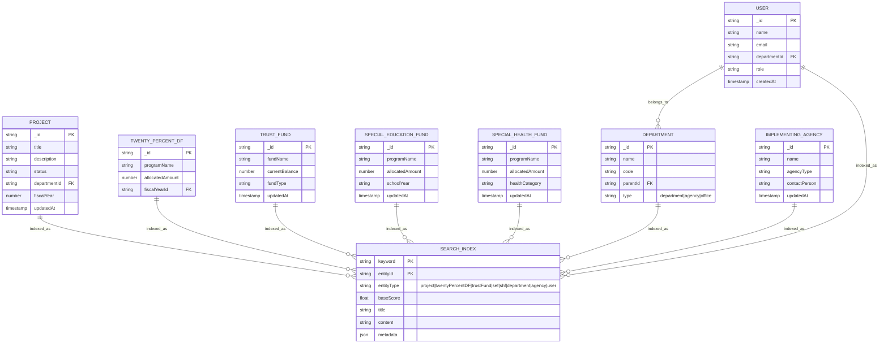

# PPDO Search System Architecture

> A Facebook-class distributed discovery engine adapted for PPDO government management.

## Overview

This document consolidates architectural decisions, data modeling, and UI specifications for implementing a unified search experience across all PPDO entities: Projects, 20% DF, Trust Funds, Special Education Fund, Special Health Fund, Departments, Implementing Agencies/Offices, and Users.

## Table of Contents

1. [Architectural Summary](#architectural-summary)
2. [Data Model (ERD)](#data-model-erd)
3. [UI/UX Specification](#uiux-specification)
4. [Implementation Roadmap](#implementation-roadmap)
5. [API Reference](./api-reference.md)
6. [Hooks & State Management](./hooks-reference.md)
7. [Error Handling](./error-handling.md)
8. [Component Examples](./component-examples.md)

---

## Architectural Summary

### The Metaphor: A Distributed Discovery Engine

Unlike simple database queries, PPDO Search functions as a **discovery engine** that:
- Aggregates results from multiple entity verticals (Projects, 20% DF, Trust Funds, SEF, SHF, Departments, Agencies, Users)
- Ranks results by relevance combining text match, organizational proximity, and recency
- Provides real-time typeahead suggestions
- Enables category-based filtering through right sidebar

### Core Patterns

#### 1. Frontend: URL-First State
The URL (`?q=infrastructure&category=project`) is the **single source of truth**:
- Enables deep linking to specific searches
- Preserves search history in browser
- Allows sharing filtered views
- Simplifies state management

#### 2. Backend: Polymorphic Index with Sharded Verticals
```
Search Query
    │
    ├──► Project Index ──────────────┐
    ├──► 20% DF Index ───────────────┤
    ├──► Trust Fund Index ───────────┼──► Aggregation Layer ──► Ranked Results
    ├──► SEF Index ──────────────────┤
    ├──► SHF Index ──────────────────┤
    ├──► Department Index ───────────┤
    ├──► Implementing Agency Index ──┤
    └──► User Index ─────────────────┘
```

#### 3. Ranking: Multi-Factor Relevance
Results are scored using:
- **Text Match (50%)**: TF-IDF based on keyword frequency in title/content
- **Organizational Proximity (30%)**: Same department = higher relevance
- **Recency (20%)**: Recently updated items get slight boost

### Performance Strategy

| Technique | Purpose |
|-----------|---------|
| Debounced Input (300ms) | Reduce query frequency during typing |
| Cursor Pagination | Efficient infinite scroll |
| Category Filtering | Quick filter without re-querying |
| Optimistic UI | Toggle categories instantly |
| Index Pre-computation | Update search indexes on write, not read |

---

## Data Model (ERD)

This schema supports high-speed typeahead, mixed-content feeds, and category-based filtering.



### Table Definitions

#### SEARCH_INDEX
The polymorphic search index storing normalized keywords for all entity types.

| Field | Type | Description |
|-------|------|-------------|
| `keyword` | string | Normalized search term (lowercase, stemmed) |
| `entityId` | string | Reference to source entity |
| `entityType` | union | Discriminator: project, twentyPercentDF, trustFund, sef, shf, department, agency, user |
| `baseScore` | number | Pre-computed base relevance score |
| `title` | string | Display title for results |
| `content` | string | Searchable content excerpt |
| `metadata` | json | Type-specific data (department, year, amounts, etc.) |

---

## UI/UX Specification

### Layout: Main Content + Right Sidebar

Since the left sidebar is already used for navigation, the search page uses a **right sidebar for category filtering**:

```
┌────────────────────────────────────────────────────────────────────────────┐
│  [Nav Sidebar] │  Main Content Area                    │  Category Sidebar │
│                │                                       │                   │
│  Dashboard     │  🔍 Search...                         │  CATEGORIES       │
│  Projects      │                                       │                   │
│  Budgets       │  ┌─────────────────────────────────┐  │  ○ All Results    │
│  Trust Funds   │  │ 📋 Road Infrastructure 2024     │  │     (24 items)   │
│  SEF           │  │     Status: Ongoing             │  │                   │
│  SHF           │  │     Dept: Planning              │  │  ● Project        │
│                │  └─────────────────────────────────┘  │     (11 items)    │
│  [More Items]  │                                       │                   │
│                │  ┌─────────────────────────────────┐  │  ○ 20% DF         │
│                │  │ 🏛️ Planning & Development       │  │     (0 items)     │
│                │  │     Department                  │  │                   │
│                │  └─────────────────────────────────┘  │  ○ Trust Funds    │
│                │                                       │     (2 items)     │
│                │  ┌─────────────────────────────────┐  │                   │
│                │  │ 👤 Maria Santos                 │  │  ○ Special Ed     │
│                │  │     Budget Officer              │  │     (3 items)     │
│                │  └─────────────────────────────────┘  │                   │
│                │                                       │  ○ Special Health │
│                │  [Load More...]                       │     (0 items)     │
│                │                                       │                   │
│                │                                       │  ○ Department     │
│                │                                       │     (4 items)     │
│                │                                       │                   │
│                │                                       │  ○ Agency/Office  │
│                │                                       │     (2 items)     │
│                │                                       │                   │
│                │                                       │  ○ User           │
│                │                                       │     (2 items)     │
└────────────────┴───────────────────────────────────────┴───────────────────┘
     Zone A              Zone B: Results Feed                Zone C: Filter
   (Existing Nav)          (Center - 55%)                  (Right - 25%)
```

### Zone A: Navigation Sidebar (Existing)
- Already contains main navigation items
- **Not modified** for search functionality

### Zone B: Main Content (Center)

**Header Section:**
- Large search input with typeahead
- Active filter indicator (if category selected)
- Clear filter option

**Results Feed:**
- Cards dynamically change based on active category
- Each card type has distinct color coding and icon

### Zone C: Category Sidebar (Right)

**Category List:**
- Shows "All Results" option with total count
- Each category shows:
  - Icon with category-specific color
  - Category name
  - Item count (e.g., "11 items found")
  - Active state with highlight
- Categories with 0 results shown but disabled

**Categories:**

| Category | Icon | Color | Description |
|----------|------|-------|-------------|
| Project | Folder | Blue | Infrastructure and development projects |
| 20% DF | Percent | Emerald | Development Fund allocations |
| Trust Funds | Wallet | Purple | Reserved funds and investments |
| Special Education | GraduationCap | Amber | Education programs and grants |
| Special Health | HeartPulse | Rose | Health programs and medical assistance |
| **Department** | **Building2** | **Indigo** | **PPDO Departments and divisions** |
| **Agency/Office** | **Landmark** | **Cyan** | **Implementing agencies and offices** |
| **User** | **UserCircle** | **Orange** | **System users and personnel** |

---

## Category-Based Card System

Each category has its own card component with relevant metadata:

### Project Card
- Status badge (Planning, Ongoing, Completed, Suspended, Cancelled)
- Department
- Fiscal Year
- Location
- Beneficiary count
- Completion rate (progress bar)
- Total cost

### 20% DF Card
- Utilization rate (progress bar with color coding)
- Allocated vs Utilized amounts
- Department
- Barangay count
- Fiscal Year

### Trust Fund Card
- Current balance (prominent display)
- Interest accrued
- Fund type badge
- Year established
- Initial amount

### Special Education Card
- Budget utilization (progress bar)
- School year
- Beneficiary schools count
- Student beneficiaries
- Program type

### Special Health Card
- Fund utilization (progress bar)
- Health category badge
- Beneficiary facilities
- Patient beneficiaries
- Fiscal year

### Department Card
- Department code
- Parent department (if applicable)
- Employee count
- Active projects count
- Contact information

### Agency/Office Card
- Agency type
- Contact person
- Contact number/email
- Address
- Active partnerships

### User Card
- Role/Position
- Department
- Email
- Phone
- Last active

---

## Implementation Roadmap

### Phase 1: Foundation (Week 1)
- [ ] Create search index tables in schema
- [ ] Implement text normalization utilities
- [ ] Build index update hooks for mutations
- [ ] Create basic search query with pagination

### Phase 2: Typeahead (Week 2)
- [ ] Implement debounced search input
- [ ] Create suggestions query
- [ ] Build prediction dropdown UI
- [ ] Add keyboard navigation

### Phase 3: Category Sidebar (Week 3)
- [ ] Implement category count aggregation
- [ ] Build right sidebar component
- [ ] Create category selection logic
- [ ] Connect to URL state

### Phase 4: Result Cards (Week 4)
- [ ] Create ProjectCard component
- [ ] Create TwentyPercentDFCard component
- [ ] Create TrustFundCard component
- [ ] Create SpecialEducationCard component
- [ ] Create SpecialHealthCard component
- [ ] **Create DepartmentCard component**
- [ ] **Create AgencyCard component**
- [ ] **Create UserCard component**
- [ ] Implement dynamic card switching

### Phase 5: Relevance & Polish (Week 5)
- [ ] Implement TF-IDF scoring
- [ ] Add organizational proximity boost
- [ ] Add loading and error states
- [ ] Implement deferred queries

---

## Key Metrics

| Metric | Target | Measurement |
|--------|--------|-------------|
| Typeahead Latency | <100ms | Time to first suggestion |
| Search Result Latency | <200ms | Time to first results |
| Category Switch | <100ms | Time to filter by category |
| Index Freshness | <5s | Delay between write and index update |
| Query Success Rate | >99.5% | Successful searches / total searches |

---

## References

- [API Reference](./api-reference.md) - Convex queries and mutations
- [Hooks Reference](./hooks-reference.md) - React hooks for search
- [Error Handling](./error-handling.md) - Error states and recovery
- [Component Examples](./component-examples.md) - Full component code

---

*Architecture based on Facebook-class search patterns adapted for PPDO government management*
*Updated: Right Sidebar Category Filter Layout v2.1 - With Departments, Agencies, and Users*
